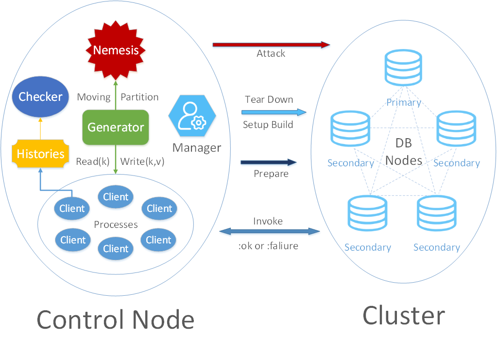
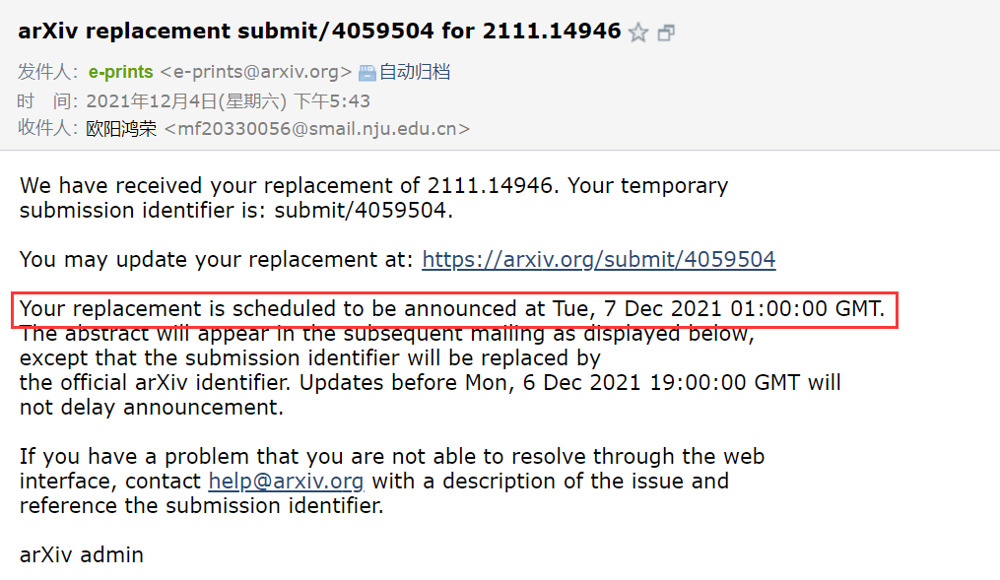
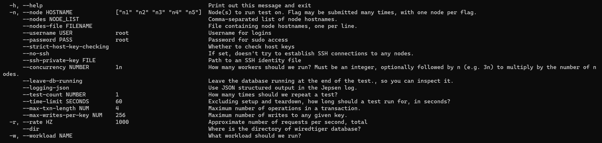

# Checking Snapshot Isolation of WiredTiger

This is the Jepsen runner of MongoDB for our paper in [[2111.14946\] Verifying Transactional Consistency of MongoDB (arxiv.org)](https://arxiv.org/abs/2111.14946).

This project is responsible for running WiredTiger transactions and collecting their execution histories into local files. 

Execution history will generated in `./store/latest/` after each test and 2 main file will be taken into checking, including:

1. **history.edn**: The execution history of transactions executed by Jepsen test framework.
2. **wiredtiger.log**:  The information of transactions parsing from write-ahead log stored in WiredTiger's `log` table.
   - It can be obtained by running [WTLogger](https://git.nju.edu.cn/Tsunaou/wiredtiger-try/-/blob/master/src/main/java/utils/WTLogger.java) after each jepsen test.

Our [MongoDB-SI-Checker](https://github.com/Tsunaou/MongoDB-SI-Checker) will take them as input and then check this execution history against Strong-SI.

The architecture of the project is provided as following. 



Actually, a WiredTiger storage engine is a standalone so the DB Nodes on the right part of the architecture figure is just the localhost of the machine running jepsen. We need **only one linux server** to run this experiment.

## 0. Update 

- The version v0.2  with proof will be announced in arxiv at Tue, 7 Dec 2021 01:00:00 GMT.

  


## 1. Configuration

### 1.1 Directly Configuration

To run this project, you NEED:

- 1 control node for running this Jepsen testing. 
  - More details for control node can be can be found in [jepsen-io](https://github.com/Tsunaou/mongodb/blob/causal-checking/github.com/jepsen-io/jepsen).
- Build WiredTiger 3.3.0 in the control node. More details could refer to [WiredTiger: Building and installing WiredTiger on POSIX](https://source.wiredtiger.com/3.2.1/build-posix.html)
- import wiredtiger.jar into this Jepsen project.

### 1.2 Docker Configuration

- [ ] TODO: We plan to build a docker image with our experiment so that anyone could run our test to avoid cockamamie configuring. It will release soon. We suggest to take this method, otherwise there may be many problems.


## 2. Getting started

### 2.1 Usage

```bash
# Usage
lein run
lein run test --help
```

### 2.2 Examples

```bash
lein run test -n 127.0.0.1 --username <username> --password <password> -w rw-register --time-limit 60 --max-txn-length 8 --concurrency 10 --leave-db-running
```

This example will run a 60 seconds read-write-register test  in each transaction under snapshot isolation in a WiredTiger standone in localhost(127.0.0.1). 10 clients will concurrently issue operations to the database. There are **at most** 8 operations or each transaction and for each key there are at most 128 write operations write into it.

**Actually, We disable the nemesis in the source code, so the partition here is meaningless.**

- 60 seconds 
  - (--time-limit 60)
- in a WiredTiger standone in localhost(127.0.0.1)
  - (-n 127.0.0.1)
- 10 clients will concurrently issue operations to the database.
  - (--concurrency 3n)
- There are **at most** 8 operations or each transaction
  - (--max-txn-length 8)

More details for the parameters can be found by `lein run test --help`



You can get the help information by running `lein run test --help`.


### 2.3 Scripts

For checking, we need more processing excluding running a pure jepsen test, like parsing WiredTiger's write-ahead log. We have encapsulated the steps of getting supplementary files for checking the transactions in WiredTiger in a scripts. You can quickly test it by running:

- `register_test.sh` 

You need input additional 2 arguments

- args[0]: `time-limit`(seconds) for this testing.
- args[1]: `max-txn-length` for each transaction.

And you need to replace the second line to equal command to drive [WTLogger](https://git.nju.edu.cn/Tsunaou/wiredtiger-try/-/blob/master/src/main/java/utils/WTLogger.java) to log the `wiredtiger.log` into `./store/latest/`. 


## 3. Datas

A sample of the run output can be obtained in [Original Data(Execution History) of WiredTiger](https://box.nju.edu.cn/f/0573d5e252be443080bd/)


## 4. License

Copyright © 2021 Hongrong Ouyang

This program and the accompanying materials are made available under the terms of the Eclipse Public License 2.0 which is available at http://www.eclipse.org/legal/epl-2.0.

This Source Code may also be made available under the following Secondary Licenses when the conditions for such availability set forth in the Eclipse Public License, v. 2.0 are satisfied: GNU General Public License as published by the Free Software Foundation, either version 2 of the License, or (at your option) any later version, with the GNU Classpath Exception which is available at https://www.gnu.org/software/classpath/license.html.

